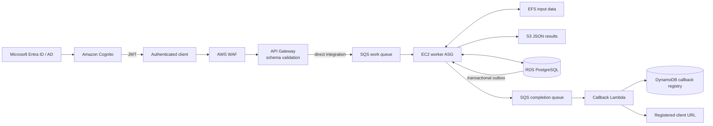

# High-scale comparison engine

I built this project to answer a practical systems question: **how do you
compare tens of thousands of structured files without turning one large job
into one large point of failure?**

The answer here is a queue-driven AWS design. A client breaks a comparison
job into folder pairs, API Gateway validates and enqueues each pair, and a
fleet of idempotent workers processes them independently. Results land in S3,
job state lives in PostgreSQL, and the client receives one callback after the
last expected pair completes.

This is a portfolio project, but the failure handling is deliberately real:
messages have leases, workers heartbeat, duplicate deliveries are safe, final
state and completion events commit together, and callback destinations are
allow-listed.

## What it demonstrates

- Asynchronous ingestion with API Gateway directly integrated with SQS
- Microsoft Entra ID / AD federation through Cognito and short-lived JWTs
- Horizontal worker scaling from queue backlog per active worker
- Multi-AZ PostgreSQL state with idempotent, concurrency-safe claims
- A transactional outbox so completion events are not lost after a DB commit
- Private access to SQS, S3, EFS, RDS, and Secrets Manager from worker subnets
- Streaming equality checks that skip CSV parsing for unchanged files
- Deterministic test-data generation and a repeatable scaling benchmark

## Architecture



[Open the standalone architecture diagram](architecture-web-app/index.html)
or read the deeper [design walkthrough](docs/ARCHITECTURE.md).

## Job contract

The client sends one request per folder pair. Requests belonging to the same
job share a UUID and declare the total expected pair count:

```json
{
  "job_id": "8ec2709b-cc70-4dbf-9986-f4c212a197d4",
  "source_folder": "folder_a",
  "destination_folder": "folder_b",
  "total_expected_pairs": 2,
  "timestamp": "2026-09-25T12:30:00Z",
  "callback_id": "client-demo"
}
```

API Gateway derives `user_id` from the validated Cognito token rather than
trusting a caller-supplied identity. A successful enqueue returns `202`.

Inside a pair, the worker reports:

- common, added, and deleted filenames;
- matching, added, and deleted columns;
- added and deleted primary keys;
- cell-level mismatches for shared columns and primary keys.

The first column is the primary key. Exact byte-for-byte matches are detected
with a bounded-memory stream comparison and bypass CSV parsing entirely.

## Processing and failure semantics

SQS provides **at-least-once delivery**, so the worker is designed around
idempotency instead of assuming each message appears once.

1. A worker claims `(job_id, source_folder, destination_folder)` in PostgreSQL.
2. Duplicate completed work is acknowledged without running again.
3. Active claims are protected by both an SQS visibility heartbeat and a DB
   heartbeat. A stale claim can be recovered by another worker.
4. The result is written to S3, then pair state is committed.
5. The last expected pair completes the parent job and inserts an outbox event
   in the **same transaction**.
6. The outbox dispatcher publishes to the completion queue. Lambda resolves
   the callback ID from DynamoDB and posts only to an approved URL.

Repeated processing failures move to a DLQ after five receives. Callback
failures have a separate queue and DLQ, so a slow client cannot block file
comparison.

## Measured local scaling

The benchmark used a 378 MB generated dataset containing 49,487 files across
200 folders. Each trial submitted 12 folder-pair tasks through LocalStack SQS
and used the same PostgreSQL/S3 worker path.

| Workers | Elapsed | Throughput | Speedup | Parallel efficiency |
|---:|---:|---:|---:|---:|
| 1 | 5.62 s | 2.135 jobs/s | 1.00× | 100.0% |
| 2 | 2.38 s | 5.052 jobs/s | 2.37× | 118.3% |
| 4 | 1.51 s | 7.955 jobs/s | 3.73× | 93.2% |

The two-worker result benefits from cache and warm-up variance in a short
trial. The useful signal is that four workers achieved **3.73×** the single
worker throughput without changing the job logic.

This proves local horizontal concurrency, not EC2 Auto Scaling behavior.
LocalStack models the ASG control plane but does not launch real instances.

## Run locally

### 1. Generate deterministic comparison data

Go 1.22 or newer is required. The same command can be run through the
`golang:1.25-alpine` container if Go is not installed locally.

```bash
go run ./tools/dummygen \
  -pairs 100 \
  -seed 42 \
  -out dummy_data
```

### 2. Install the worker dependencies

```bash
python -m venv scripts/.venv
scripts/.venv/bin/pip install -r scripts/requirements.txt
```

### 3. Provision LocalStack Pro

Follow [terraform/LOCALSTACK.md](terraform/LOCALSTACK.md). The entire control
plane was verified with one Terraform apply: 76 resources created, followed
by a clean no-change plan.

### 4. Run the checks

```bash
scripts/.venv/bin/python -m unittest discover -s scripts/tests -v
scripts/.venv/bin/python -m unittest discover -s callback -v
go test ./...
terraform -chdir=terraform fmt -check -recursive
terraform -chdir=terraform validate
```

## Repository map

| Path | Purpose |
|---|---|
| `tools/dummygen` | Generates paired `.random` CSV fixtures with controlled differences |
| `tools/jobclient` | Validates folders and submits flattened pair requests |
| `scripts/src` | Worker, comparison engine, DB repository, outbox, and S3 writer |
| `callback` | SQS-triggered completion callback Lambda |
| `packer` | Builds an Amazon Linux worker AMI |
| `terraform` | AWS networking, security, compute, storage, queues, and observability |
| `architecture-web-app` | Standalone visual architecture walkthrough |

## What remains for a real AWS account

LocalStack is enough to validate resource wiring and application behavior,
but it cannot prove every managed-service runtime characteristic. A real AWS
deployment still needs to verify:

- AMI boot, EFS mounting, and worker startup on EC2;
- CloudWatch-driven ASG scale-out and scale-in;
- Microsoft Entra SAML login against a real tenant;
- WAF enforcement, RDS failover, and private endpoint routing;
- callback delivery to a real HTTPS client under load.

Those are deployment validations, not missing application features.
